```r
library(tidyverse)
```

```
## ── Attaching packages ───────────────────────────────────────────────────────────────────────────────────────────── tidyverse 1.3.0 ──
```

```
## ✓ ggplot2 3.3.2     ✓ purrr   0.3.4
## ✓ tibble  3.0.3     ✓ dplyr   1.0.2
## ✓ tidyr   1.1.2     ✓ stringr 1.4.0
## ✓ readr   1.3.1     ✓ forcats 0.5.0
```

```
## ── Conflicts ──────────────────────────────────────────────────────────────────────────────────────────────── tidyverse_conflicts() ──
## x dplyr::filter() masks stats::filter()
## x dplyr::lag()    masks stats::lag()
```

```r
library(janitor)
```

```
## 
## Attaching package: 'janitor'
```

```
## The following objects are masked from 'package:stats':
## 
##     chisq.test, fisher.test
```

```r
library(here)
```

```
## here() starts at /Users/Pepe/Dropbox/Postdoc/03_ELA/Teaching/UofM/R course/2020/Class materials/Wk06-Class_materials
```

```r
library(palmerpenguins)

library(ggridges)
library(viridis)
```

```
## Loading required package: viridisLite
```


```r
argentina_data <- read_delim(here("data", "Argentina.txt"), delim = "\t")
```

```
## Parsed with column specification:
## cols(
##   data = col_character(),
##   L.acuta = col_double(),
##   H.similis = col_double(),
##   U.uruguayensis = col_double(),
##   N.succinea = col_double(),
##   MedSand = col_double(),
##   FineSand = col_double(),
##   Mud = col_double(),
##   OrganMat = col_double(),
##   Season = col_double(),
##   Transect = col_double(),
##   `River ` = col_double()
## )
```


```r
argentina_clean <- argentina_data %>% 
  clean_names() %>% 
  pivot_longer(cols = c(l_acuta, h_similis, u_uruguayensis, n_succinea), 
               names_to = "species",
               values_to = "counts") %>% 
  rename(site = data)
```

# More  bar plots

I have expressed my disapproval of bar plots, however i indicated that there are still some acceptable uses for them. One of these, could be species counts. If you are going to use them, you should be aware of your options.

## Stacked bars

Plain stacked bars vary in height depending on the total value of the stack. Great for showing differences in the absolute number of, for example, organisms between sites, while also showing differences in composition.


```r
argentina_clean %>% 
  filter(season == "2") %>% 
  ggplot() +
  geom_col(aes(x = site, y = counts, fill = species))
```

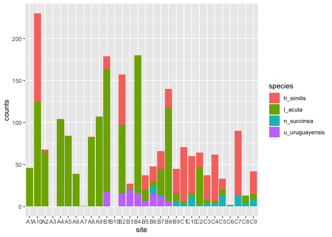<!-- -->


## Stacked bars percent

In this version, we loose the information relative to the differneces in the total counts per site, but we make difference sin species composition much more obvious.


```r
argentina_clean %>% 
  filter(season == "2") %>% 
  ggplot() +
  geom_col(aes(x = site, y = counts, fill = species), position = "fill")
```

```
## Warning: Removed 8 rows containing missing values (geom_col).
```

<!-- -->

## Side-by-dide bars

Not quite aplicable for the particular case of species counts, but it can be handy in some instances.


```r
argentina_clean %>% 
  filter(season == "2") %>% 
  ggplot() +
  geom_col(aes(x = site, y = counts, fill = species), position = "dodge")
```

<!-- -->


of course, you can always use tools like faceting to include more variables, like season in this case


```r
argentina_clean %>% 
  ggplot() +
  facet_wrap(~season) +
  geom_col(aes(x = site, y = counts, fill = species), position = "fill")
```

```
## Warning: Removed 8 rows containing missing values (geom_col).
```

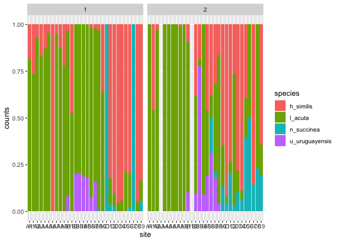<!-- -->


# Distributions

Showing the actual distribution of the date can be very helpful to discern the nature of the distribution (e.g. normal, poison, bimodal) of your data, but also to visually assess overlap (and hence, have an idea of any potencial sdifferences)

`geom_histogram()` will create histograms from your data with automatic binning


```r
penguins %>% 
  ggplot() +
  facet_wrap(~species) +
  geom_histogram(aes(x = body_mass_g))
```

```
## `stat_bin()` using `bins = 30`. Pick better value with `binwidth`.
```

```
## Warning: Removed 2 rows containing non-finite values (stat_bin).
```

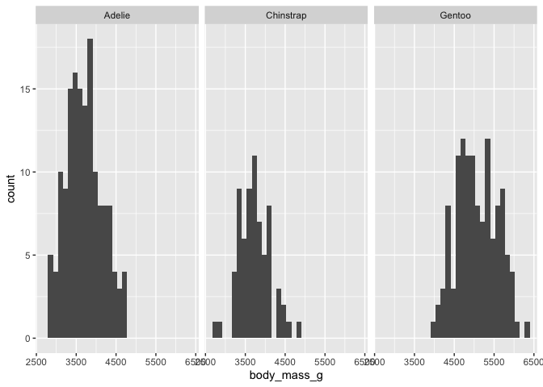<!-- -->

`geom_density()` is also very helpful as a *smooth* version of the histogram


```r
penguins %>% 
  ggplot() +
  geom_density(aes(x = body_mass_g, fill = species), alpha = 0.4)
```

```
## Warning: Removed 2 rows containing non-finite values (stat_density).
```

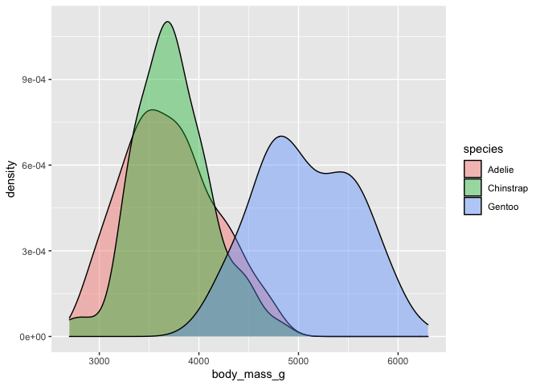<!-- -->

An option that is becoming quite popular is the `geom_density_ridgelines()` which is part of is part of the `ggridges` package by Claus Wilke. It is great to show the overlap between distributions, and hence, highlight any existing differences.


```r
penguins %>% 
  ggplot() +
  geom_density_ridges(aes(x = body_mass_g, y = species, fill = species), alpha = 0.4, scale = 100) 
```

```
## Picking joint bandwidth of 153
```

```
## Warning: Removed 2 rows containing non-finite values (stat_density_ridges).
```

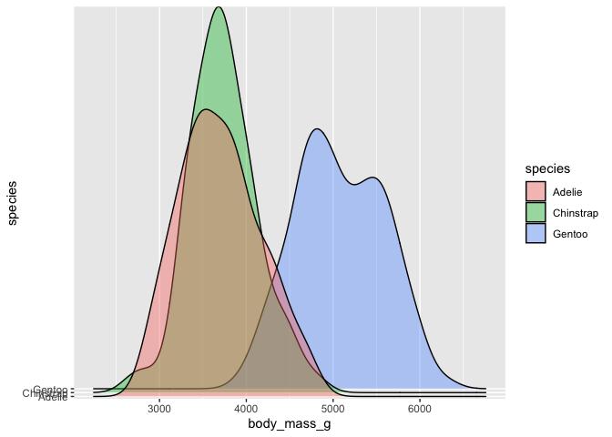<!-- -->


# Scales

## carefull with "zooming"

You might want to adjust the extent of your axes to *"zoom in"* in a section.

There are two aproaches in ggplot, but **be careful** because they have two very different behaviours.


Lets start by showing the distribution of the penguins' body weght again. For this example we are going to introduce `geom_violin` wich is also a quite popular version of a box plot which shows where the bulk of the data is located.

Here is the default:


```r
penguins %>% 
  ggplot() +
  geom_violin(aes(x = body_mass_g, y = species, fill = species))
```

```
## Warning: Removed 2 rows containing non-finite values (stat_ydensity).
```

<!-- -->


Now... Be very careful, when you indicate the limits on the scales, you are **not** "zooming in", you are selecting the range of data you want to use. Which means that all stats computed during a ggplot, will change!!


```r
penguins %>% 
  
  # main plot elements
  ggplot() +
  geom_violin(aes(x = body_mass_g, y = species, fill = species)) +
  
  # scales
  scale_x_continuous(limits = c(4000,10000))
```

```
## Warning: Removed 167 rows containing non-finite values (stat_ydensity).
```

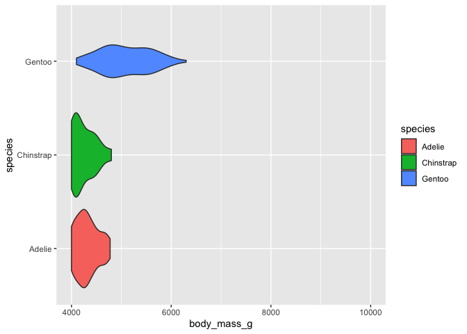<!-- -->

`coord_catersian` on the other hand, does work like a zoom!! use it if you are expecting R to conduct any calculations in your plot.


```r
penguins %>% 
  
  # main plot elements
  ggplot() +
  geom_violin(aes(x = body_mass_g, y = species, fill = species)) +
 
   # scales
  coord_cartesian(xlim = c(4000,10000))
```

```
## Warning: Removed 2 rows containing non-finite values (stat_ydensity).
```

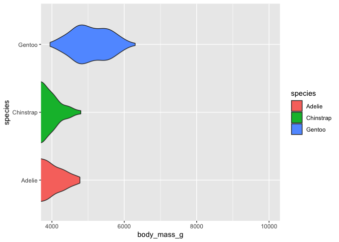<!-- -->


## playing with your scales

First i am going to make some mock data of the concentrations of two compounds measured at different depths (could be a soil, could be a lake, could be the ocean...)


```r
set.seed(1111)

depth_data <- tibble(depth = seq(0,1000, by = 100),
                     compound_a = sort(abs(rnorm(11, 1000, 10000))),
                     compound_b = abs(rnorm(11, 80, 50)))
```


Lets give it a first try to plotting them


```r
depth_data %>% 
  pivot_longer(cols = -depth, 
               names_to = "compound", 
               values_to = "concentration") %>% 
  ggplot() +
  geom_point(aes(x = concentration, y = depth, colour = compound)) +
  geom_path(aes(x = concentration, y = depth, colour = compound))
```

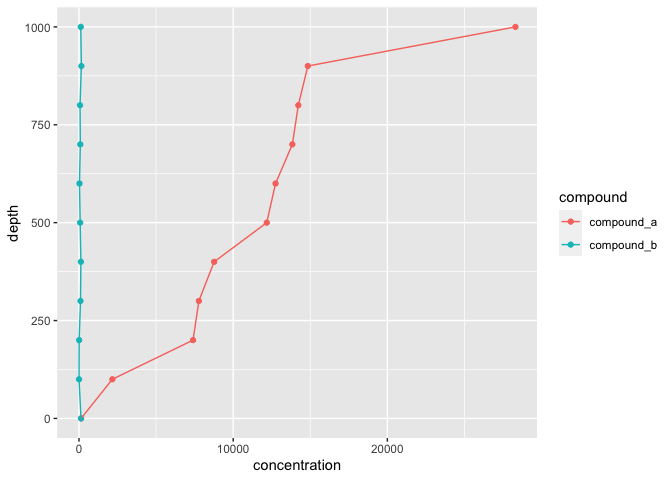<!-- -->

But depth is easier seen if it goes **down**!


```r
depth_data %>% 
  pivot_longer(cols = -depth, 
               names_to = "compound", 
               values_to = "concentration") %>% 
  ggplot() +
  geom_point(aes(x = concentration, y = depth, colour = compound)) +
  geom_path(aes(x = concentration, y = depth, colour = compound)) +
  
  scale_y_reverse()
```

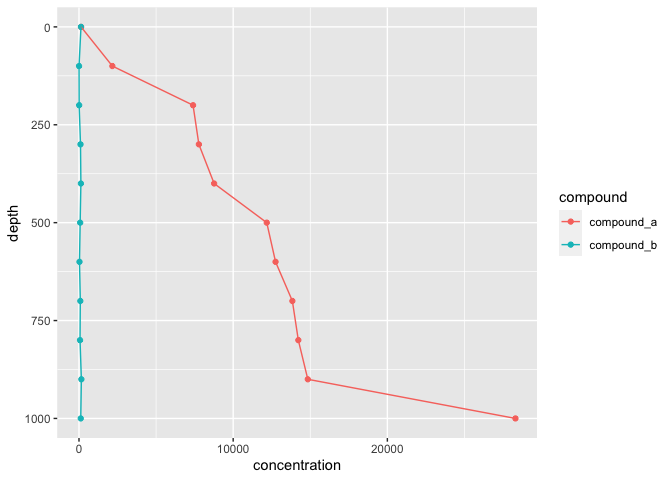<!-- -->

Now... there is such a difference in concentrations... Let's see if i can log the x axis!


```r
depth_data %>% 
  pivot_longer(cols = -depth, 
               names_to = "compound", 
               values_to = "concentration") %>% 
  
  #main plotting elements
  ggplot() +
  geom_point(aes(x = concentration, y = depth, colour = compound)) +
  geom_path(aes(x = concentration, y = depth, colour = compound)) +

  
  #scales
  scale_y_reverse() +
  scale_x_log10()
```

<!-- -->
## Expansion - addedd padding and how to deal with it


```r
depth_data %>% 
  pivot_longer(cols = -depth, 
               names_to = "compound", 
               values_to = "concentration") %>% 
  
  #main plotting elements
  ggplot() +
  geom_point(aes(x = concentration, y = depth, colour = compound)) +
  geom_path(aes(x = concentration, y = depth, colour = compound)) +

  
  #scales
  scale_y_reverse(expand = expansion(mult = 0, add = 0)) +
  scale_x_log10()
```

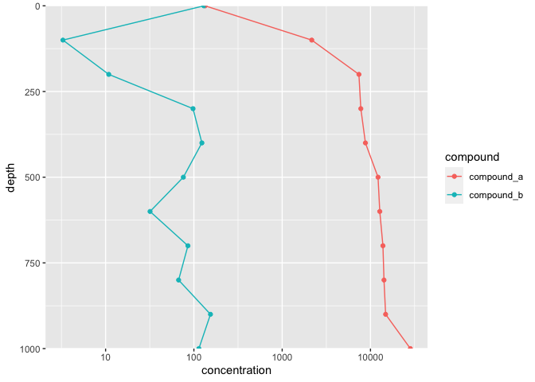<!-- -->

# Lines, all the lines!!

So far we have used `geom_path()`. `geom_path()` connects the dots in the order they appear in the dataset, which was great for our depth case


```r
depth_data %>% 
  pivot_longer(cols = -depth, names_to = "compound", values_to = "concentration") %>% 
  
  #main plotting elements
  ggplot() +
  geom_point(aes(x = concentration, y = depth, colour = compound)) +
  geom_path(aes(x = concentration, y = depth, colour = compound)) +

  
  #scales
  scale_y_reverse() +
  scale_x_log10()
```

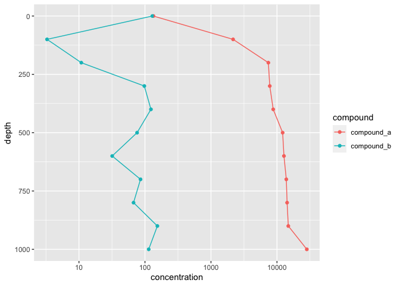<!-- -->


`geom_line()` is a more comon function, that is because it draws the lines in the order in which the pints appear in the x axis. Unfortunately, that would not have worked, for our depth plot!

Lets see...


```r
depth_data %>% 
  pivot_longer(cols = -depth, names_to = "compound", values_to = "concentration") %>% 
  
  #main plotting elements
  ggplot() +
  geom_point(aes(x = concentration, y = depth, colour = compound)) +
  geom_line(aes(x = concentration, y = depth, colour = compound)) +

  
  #scales
  scale_y_reverse() +
  scale_x_log10()
```

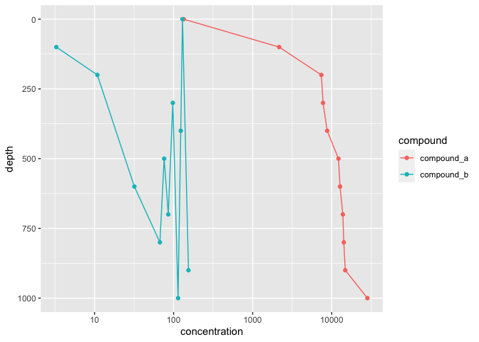<!-- -->

However most times, you will be plotting lines in the horizontal direction (think **time series!**), so `geom_line()` will be perfect

`geom_step()` if a bit more unike, but it is a common plotting aproach for things like **survival curves**. It also goes in the direction of the x


```r
depth_data %>% 
  pivot_longer(cols = -depth, names_to = "compound", values_to = "concentration") %>% 
  
  #main plotting elements
  ggplot() +
  geom_point(aes(x = concentration, y = depth, colour = compound)) +
  geom_step(aes(x = concentration, y = depth, colour = compound)) +

  
  #scales
  scale_y_reverse() +
  scale_x_log10()
```

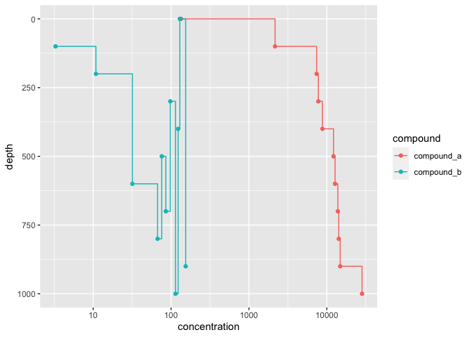<!-- -->

There is a last option, when we want to include fixed lines (e.g. for a reference level). for this we use `geom_vline


```r
depth_data %>% 
  pivot_longer(cols = -depth, 
               names_to = "compound", 
               values_to = "concentration") %>% 
  
  #main plotting elements
  ggplot() +
  geom_point(aes(x = concentration, y = depth, colour = compound)) +
  geom_path(aes(x = concentration, y = depth, colour = compound)) +
  
  geom_hline(aes(yintercept = 500), linetype = "dashed") +
  
  geom_hline(aes(yintercept = 250), linetype = "dotdash") +
  
  geom_vline(aes(xintercept = 1000)) +
  


  #scales
  scale_y_reverse(expand = expansion(mult = 0, add = 0)) +
  scale_x_log10()
```

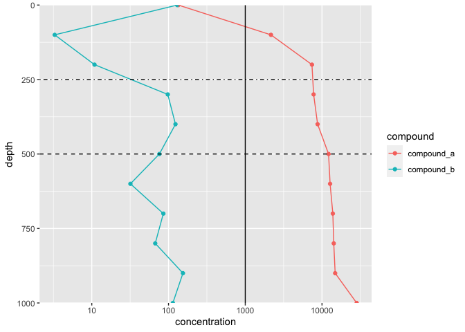<!-- -->


# discrete vs continus scales


```r
site_data <- tibble(site = rep(c(1,2,3,4,5), each = 10),
       concentration = c(abs(rnorm(10, 8, 3)),
                         abs(rnorm(10, 10, 10)),
                         abs(rnorm(10, 4, 0.5)),
                         abs(rnorm(10, 15, 8)),
                         abs(rnorm(10, 5, 3))))
```


```r
site_data %>% 
  ggplot() +
  geom_boxplot(aes(x = site, y = concentration))
```

```
## Warning: Continuous x aesthetic -- did you forget aes(group=...)?
```

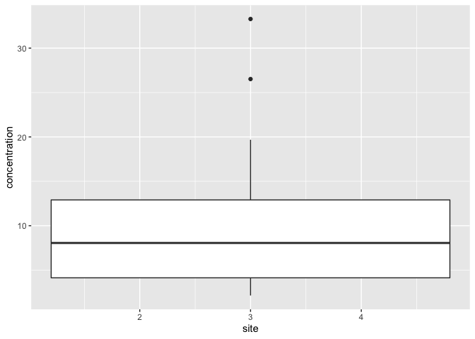<!-- -->


```r
site_data %>% 
  ggplot() +
  geom_point(aes(x = site, y = concentration, colour = site))
```

<!-- -->


```r
site_data %>% 
  mutate(site = as.factor(site)) %>% 
  ggplot() +
  geom_boxplot(aes(x = site, y = concentration))
```

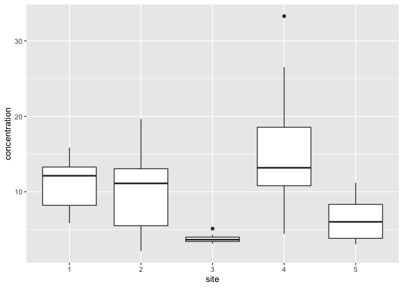<!-- -->


```r
site_data %>%
  mutate(site = as.factor(site)) %>% 
  ggplot() +
  geom_point(aes(x = site, y = concentration, colour = site))
```

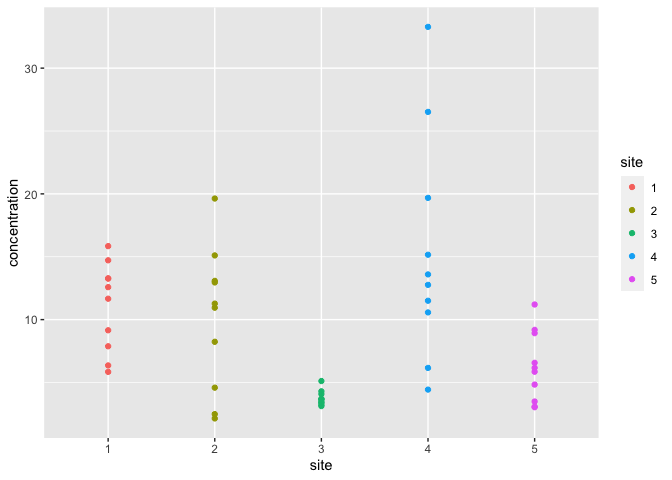<!-- -->

Talking about colour scales scales...


```r
site_data %>%
  mutate(site = as.factor(site)) %>% 
  # main plotting elements
  ggplot() +
  geom_point(aes(x = site, y = concentration, colour = site)) +
  
  # scales
  
  scale_color_viridis(discrete = TRUE)
```

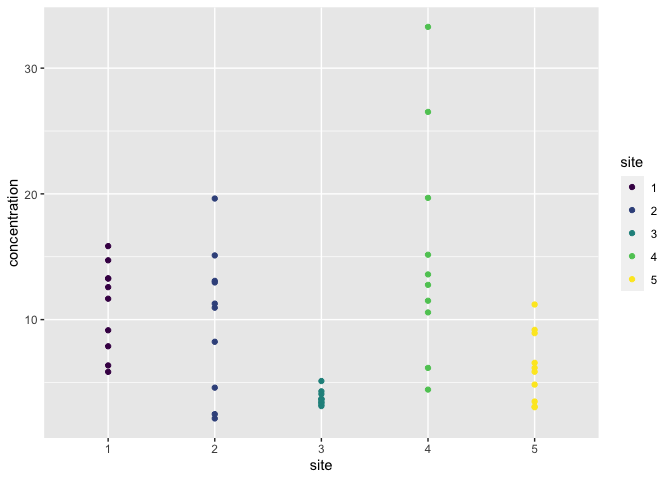<!-- -->


```r
site_data %>%
  mutate(site = as.factor(site)) %>% 
  # main plotting elements
  ggplot() +
  geom_point(aes(x = site, y = concentration, colour = site)) +
  
  # scales
  
  scale_color_viridis(discrete = TRUE, option = "magma")
```

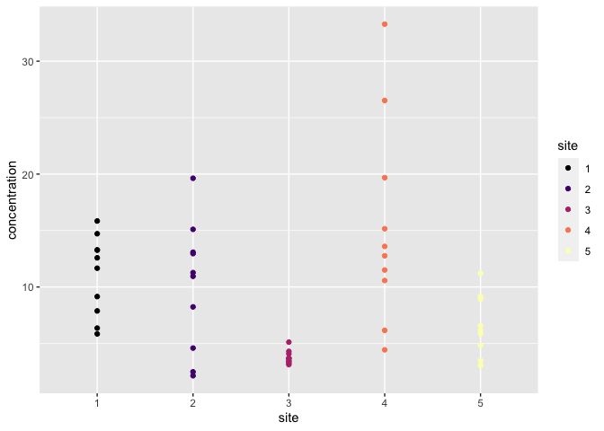<!-- -->


# Default Themes


By now you  must be used to that grey background... Well, there are more options! ggplot comes wth a series of default themes!

## theme black and white


```r
depth_data %>% 
  pivot_longer(cols = -depth, 
               names_to = "compound", 
               values_to = "concentration") %>% 
  
  #main plotting elements
  ggplot() +
  geom_point(aes(x = concentration, y = depth, colour = compound)) +
  geom_path(aes(x = concentration, y = depth, colour = compound)) +
  geom_hline(aes(yintercept = 500), linetype = "dashed") +

  #scales
  scale_y_reverse(expand = expansion(mult = 0, add = 0)) +
  scale_x_log10() +
  
  # themes
  
  theme_bw()
```

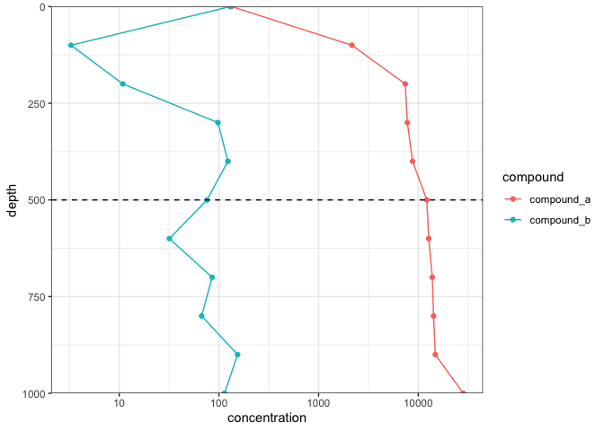<!-- -->


## theme classic


```r
depth_data %>% 
  pivot_longer(cols = -depth, names_to = "compound", values_to = "concentration") %>% 
  
  #main plotting elements
  ggplot() +
  geom_point(aes(x = concentration, y = depth, colour = compound)) +
  geom_path(aes(x = concentration, y = depth, colour = compound)) +
  geom_hline(aes(yintercept = 500), linetype = "dashed") +

  #scales
  scale_y_reverse(expand = expansion(mult = 0, add = 0)) +
  scale_x_log10() +
  
  # themes
  
  theme_classic()
```

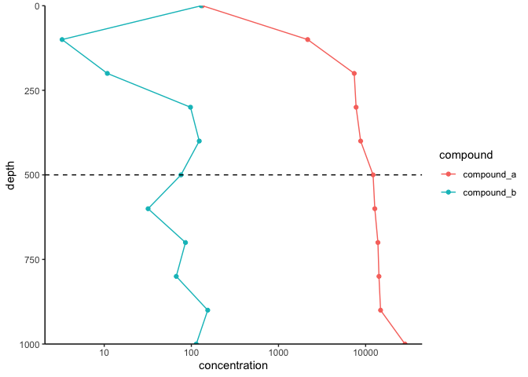<!-- -->


## theme minimal


```r
depth_data %>% 
  pivot_longer(cols = -depth, 
               names_to = "compound", 
               values_to = "concentration") %>% 
  
  #main plotting elements
  ggplot() +
  geom_rect(data = tibble(ymin = 250, ymax = 500, xmin = 10, xmax = Inf), 
            aes(ymin = ymin, ymax = ymax, xmin = xmin, xmax = xmax), alpha = 0.2) +
  geom_point(aes(x = concentration, y = depth, colour = compound)) +
  geom_path(aes(x = concentration, y = depth, colour = compound)) +
  geom_hline(aes(yintercept = 500), linetype = "dashed") +

  #scales
  scale_y_reverse(expand = expansion(mult = 0, add = 0)) +
  scale_x_log10(limits = c(10, 50000)) +
  
  # themes
  
  theme_minimal()
```

```
## Warning: Removed 1 rows containing missing values (geom_point).
```

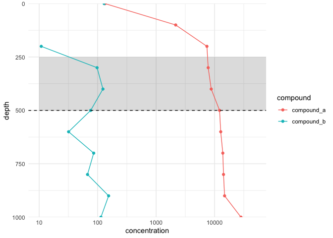<!-- -->


